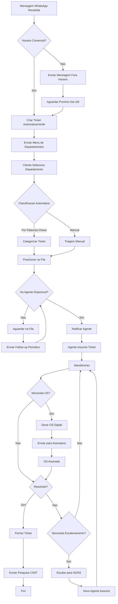
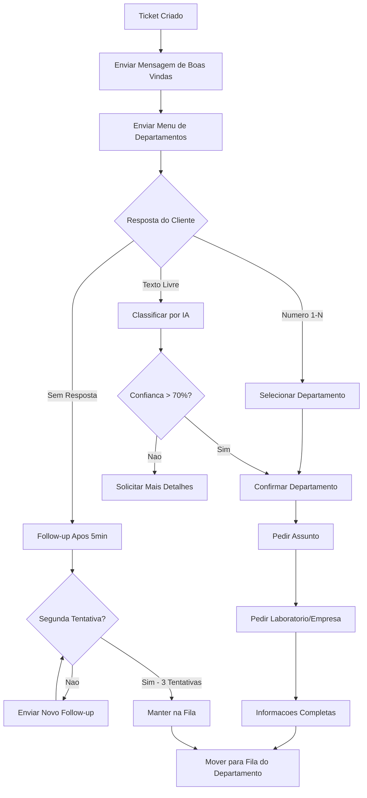
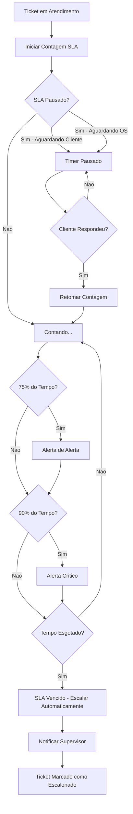
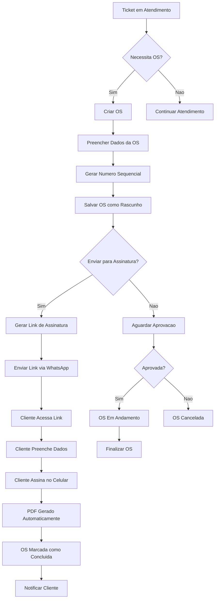
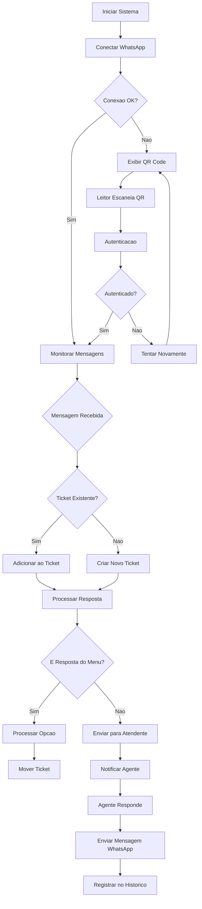
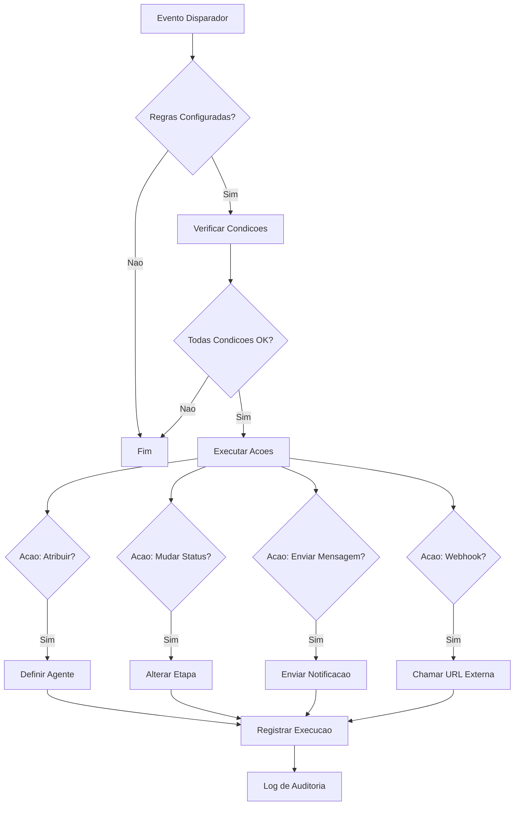
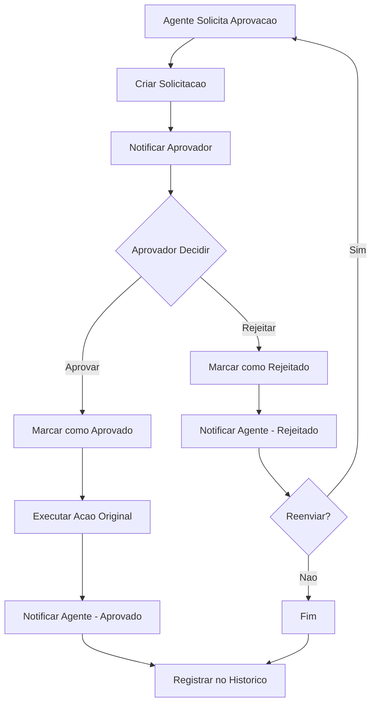
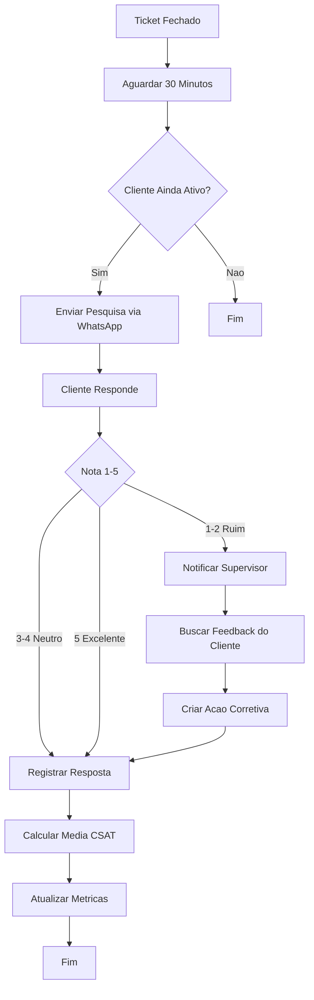

# CodeHelp CRM - Documentacao Completa com Fluxogramas

## Sumario

1. [Visao Geral do Sistema](#1-visao-geral-do-sistema)
2. [Fluxogramas](#2-fluxogramas)
3. [Manual de Instrucoes](#3-manual-de-instrucoes)
4. [Referencia de Endpoints](#4-referencia-de-endpoints)

---

## 1. Visao Geral do Sistema

O CodeHelp e uma plataforma completa de **Helpdesk + CRM** desenvolvida para laboratorios, hospitais e clinicas. Ele integra gestao de clientes, ordens de servico, comunicacao via WhatsApp e inteligencia artificial em um unico sistema.

### Stack Tecnologica

| Camada | Tecnologia |
|--------|-----------|
| Backend | Node.js + Express + TypeScript |
| ORM | Prisma + PostgreSQL (producao) / SQLite (dev) |
| Frontend | React 18 + Vite + Tailwind CSS |
| WhatsApp | whatsapp-web.js (puppeteer) |
| IA | Anthropic Claude API |
| Mobile | React Native + Expo |

### Modulos Principais

| Modulo | Descricao |
|--------|-----------|
| Helpdesk | Gestao de tickets com Kanban, SLA, triagem automatica |
| Clientes (CRM) | Gestao completa de clientes, contatos e oportunidades |
| Ordens de Servico | OS com assinatura digital via WhatsApp |
| WhatsApp | Integracao nativa com menu interativo |
| Base de Conhecimento | Artigos com sugestao por IA |
| Automacoes | Regras WHEN/IF/THEN configuraveis |
| Robos IA | Classificacao automatica e sugestoes |
| Dashboard | KPIs, graficos e insights de IA |

### Hierarquia de Usuarios

| Nivel | Roles | Permissoes |
|-------|-------|-----------|
| Admin | admin | Acesso total, gestao de usuarios e configuracoes |
| Supervisor | gerente | Aprovar, escalonar, metricas, configuracoes |
| Agente | tecnico, comercial, vendedor | Atender tickets, criar OS, gerenciar clientes |
| Solicitante | solicitante | Apenas visualizar |

---

## 2. Fluxogramas

### 2.1 Fluxo Principal do Helpdesk

### 2.2 Fluxo de Triagem Automatica

### 2.3 Fluxo de Gestao de SLA

### 2.4 Fluxo de Ordem de Servico

### 2.5 Fluxo de Integracao WhatsApp

### 2.6 Fluxo de Automacoes

### 2.7 Fluxo de Aprovacoes

### 2.8 Fluxo de Pesquisa CSAT

---

## 3. Manual de Instrucoes

### 3.1 Primeiro Acesso

#### Passo 1: Acessar o Sistema
1. Abra o navegador e acesse a URL do sistema
2. Voce vera a pagina de login

#### Passo 2: Fazer Login
1. Digite seu email (ex: admin@codemed.com.br)
2. Digite sua senha (ex: admin123)
3. Clique em **Entrar**
4. Voce sera redirecionado para o Dashboard

#### Passo 3: Configuracao Inicial (Admin)
1. Acesse **Configuracoes** no menu lateral
2. Configure os departamentos padrao
3. Cadastre os niveis de suporte (N1, N2, N3)
4. Configure os horarios de atendimento
5. Cadastre os feriados nacionais

---

### 3.2 Gestao de Clientes (CRM)

#### Criar Novo Cliente
1. Clique em **Clientes** no menu lateral
2. Clique em **Novo Cliente**
3. Preencha os dados:
   - **Razao Social** (obrigatorio)
   - **Nome Fantasia**
   - **CNPJ**
   - **Segmento** (Laboratorio, Hospital, Clinica, etc.)
   - **Origem** (WhatsApp, Manual, Web)
4. Clique em **Salvar**

#### Visualizar Detalhes do Cliente
1. Na lista de clientes, clique no nome do cliente
2. Voce vera:
   - Dados cadastrais
   - Lista de contatos
   - Colaboradores vinculados
   - Oportunidades de venda
   - Historico de interacoes

#### Vincular Contato ao Cliente
1. No detalhe do cliente, clique em **Novo Contato**
2. Selecione o tipo (Telefone, Email, Reuniao, Visita)
3. Preencha os detalhes
4. Clique em **Salvar**

#### Gerenciar Colaboradores
1. No detalhe do cliente, va em **Colaboradores**
2. Clique em **Adicionar Colaborador**
3. Preencha nome, cargo, departamento, email, telefone
4. Marque como **Principal** se necessario

---

### 3.3 Helpdesk - Atendimento de Tickets

#### Visualizar Kanban
1. Clique em **Helpdesk** no menu lateral
2. Voce vera o board Kanban com as etapas:
   - **Triagem** - Tickets aguardando direcionamento
   - **Fila de Espera** - Aguardando atendente
   - **Em Atendimento** - Sendo atendido
   - **Aguardando Cliente** - Esperando resposta
   - **Aguardando OS** - Pendente de OS
   - **Concluido** - Finalizados
   - **Descartados** - Spam/invalidos

#### Assumir um Ticket
1. Clique em um ticket na coluna **Fila de Espera**
2. No painel lateral, clique em **Atribuir a mim**
3. O ticket mudara para **Em Atendimento**

#### Responder Mensagem
1. Com o ticket aberto, digite sua mensagem na caixa de texto
2. Clique em **Enviar** ou pressione Enter
3. A mensagem sera enviada via WhatsApp

#### Mover Ticket de Etapa
1. Arraste o card para a coluna desejada
2. Ou clique no menu do card e selecione **Mover para**

#### Gerar Ordem de Servico
1. No ticket aberto, clique em **Gerar OS**
2. Preencha os dados da OS:
   - Tipo de servico
   - Descricao
   - Equipamento
   - Valor
3. Clique em **Criar OS**
4. O link de assinatura sera gerado automaticamente

#### Escalonar Ticket
1. No ticket aberto, clique em **Encaminhar**
2. Selecione o departamento de destino
3. Adicione observacoes
4. Confirme o encaminhamento

#### Descartar Ticket
1. No menu do card, selecione **Descartar**
2. Confirme a acao
3. O ticket sera movido para **Descartados**

---

### 3.4 Ordens de Servico (OS)

#### Criar OS
1. Clique em **OS** no menu lateral
2. Clique em **Nova OS**
3. Selecione o cliente
4. Preencha:
   - Tipo de servico
   - Descricao detalhada
   - Equipamento envolvido
   - Sistemas afetados
   - Valor estimado
5. Clique em **Salvar**

#### Enviar para Assinatura
1. No detalhe da OS, clique em **Enviar para Assinatura**
2. O sistema gerara um link unico
3. O link sera enviado via WhatsApp automaticamente
4. O cliente acessara e assinara digitalmente

#### Acompanhar Status
- **Rascunho** - OS sendo editada
- **Em Andamento** - Servico em execucao
- **Aguardando Aprovacao** - Pendente de assinatura
- **Concluido** - Servico finalizado
- **Cancelado** - OS cancelada

---

### 3.5 WhatsApp - Comunicacao

#### Conectar WhatsApp
1. Acesse **WhatsApp** no menu lateral
2. Clique em **Conectar**
3. Escaneie o QR Code com seu celular
4. A conexao sera estabelecida

#### Monitorar Conversas
1. Na aba **WhatsApp**, voce vera:
   - Lista de conversas ativas
   - Tickets associados
   - Status de cada conversa

#### Enviar Mensagem
1. Selecione uma conversa ou ticket
2. Digite sua mensagem
3. Clique em **Enviar**

#### Transferir Conversa
1. Na conversa, clique em **Transferir**
2. Selecione o novo atendente
3. Confirme a transferencia

---

### 3.6 Base de Conhecimento

#### Criar Artigo
1. Clique em **Base de Conhecimento**
2. Clique em **Novo Artigo**
3. Preencha:
   - Titulo
   - Conteudo (suporta Markdown)
   - Resumo
   - Tags
   - Categoria
4. Clique em **Salvar como Rascunho**

#### Publicar Artigo
1. No artigo, clique em **Publicar**
2. O artigo ficara disponivel para consulta
3. Agentes podem sugerir artigos automaticamente

#### Consultar Artigos
1. Use a barra de busca para encontrar artigos
2. Filtre por categoria ou tags
3. Clique para ver o conteudo completo

---

### 3.7 Automacoes

#### Criar Regra de Automacao
1. Acesse **Automacoes** no menu lateral
2. Clique em **Nova Regra**
3. Configure:
   - **Nome** da regra
   - **Evento Disparador** (novo_ticket, msg_recebida, etc.)
   - **Condicoes** (campo, operador, valor)
   - **Acoes** (atribuir, mudar_status, enviar_msg, etc.)
4. Clique em **Salvar**

#### Testar Regra
1. Na regra, clique em **Testar**
2. Forneca um contexto simulado
3. Veja o resultado da execucao

---

### 3.8 Dashboard

#### Visualizar KPIs
1. Acesse **Dashboard** no menu lateral
2. Voce vera cards com:
   - Chamados no mes
   - Em aberto
   - Resolvidos
   - TMR Medio
   - OS no mes
   - Clientes ativos

#### Analisar Graficos
1. Role para baixo para ver graficos de:
   - Tickets por periodo
   - Por categoria
   - Por atendente
   - Por status
   - Por prioridade
   - Tempo de resposta

#### Ver Insights de IA
1. Na secao **Insights**, veja analises automaticas de:
   - Tendencias de atendimento
   - Sugestoes de melhoria
   - Alertas de problemas

---

### 3.9 Configuracoes (Admin)

#### Gerenciar Usuarios
1. Acesse **Configuracoes > Usuarios**
2. Clique em **Novo Usuario**
3. Preencha nome, email, senha, role
4. Atribua departamentos
5. Clique em **Salvar**

#### Configurar Helpdesk
1. Acesse **Configuracoes > Helpdesk**
2. Configure:
   - Etapas do Kanban
   - Mensagens automaticas
   - Horarios de atendimento
   - Regras de classificacao

#### Gerenciar Permissoes
1. Acesse **Configuracoes > Permissoes**
2. Selecione a role
3. Marque/desmarque permissoes
4. As alteracoes sao aplicadas imediatamente

---

### 3.10 Atalhos e Dicas

#### Atalhos de Teclado
- **Enter** - Enviar mensagem
- **Esc** - Fechar dialogo
- **Tab** - Navegar entre campos

#### Dicas de Uso
1. **Busca Global**: Use a barra de busca no topo para encontrar qualquer coisa
2. **Notificacoes**: Clique no sino para ver notificacoes nao lidas
3. **Tema**: Mude entre modo claro/escuro em Configuracoes
4. **Sidebar**: Clique no icone para expandir/recolher o menu
5. **Filtros**: Use os filtros no Kanban para encontrar tickets especificos

---

## 4. Referencia de Endpoints

### 4.1 Autenticacao

| Metodo | Endpoint | Descricao |
|--------|----------|-----------|
| POST | `/api/auth/login` | Login |
| POST | `/api/auth/refresh` | Renovar token |
| GET | `/api/auth/me` | Perfil do usuario |

### 4.2 Clientes

| Metodo | Endpoint | Descricao |
|--------|----------|-----------|
| GET | `/api/crm/clients` | Listar clientes |
| POST | `/api/crm/clients` | Criar cliente |
| PUT | `/api/crm/clients/:id` | Atualizar cliente |
| DELETE | `/api/crm/clients/:id` | Deletar cliente |

### 4.3 Helpdesk

| Metodo | Endpoint | Descricao |
|--------|----------|-----------|
| GET | `/api/helpdesk/kanban` | Board Kanban |
| POST | `/api/helpdesk/tickets/:id/move` | Mover ticket |
| PATCH | `/api/helpdesk/tickets/:id/atribuir` | Atribuir ticket |
| POST | `/api/helpdesk/tickets/:id/triage` | Triagem |

### 4.4 WhatsApp

| Metodo | Endpoint | Descricao |
|--------|----------|-----------|
| GET | `/api/whatsapp/status` | Status conexao |
| GET | `/api/whatsapp/qrcode` | QR Code |
| POST | `/api/whatsapp/connect` | Conectar |
| POST | `/api/whatsapp/send` | Enviar mensagem |

### 4.5 OS

| Metodo | Endpoint | Descricao |
|--------|----------|-----------|
| GET | `/api/orders` | Listar OS |
| POST | `/api/orders` | Criar OS |
| POST | `/api/orders/:id/send-signature` | Enviar assinatura |
| GET | `/api/orders/:id/pdf` | Baixar PDF |

### 4.6 Base de Conhecimento

| Metodo | Endpoint | Descricao |
|--------|----------|-----------|
| GET | `/api/kb` | Listar artigos |
| POST | `/api/kb` | Criar artigo |
| POST | `/api/kb/:id/publicar` | Publicar artigo |

### 4.7 Automacoes

| Metodo | Endpoint | Descricao |
|--------|----------|-----------|
| GET | `/api/automations` | Listar regras |
| POST | `/api/automations` | Criar regra |
| POST | `/api/automations/testar` | Testar regra |

### 4.8 Configuracoes

| Metodo | Endpoint | Descricao |
|--------|----------|-----------|
| GET | `/api/users` | Listar usuarios |
| POST | `/api/users` | Criar usuario |
| GET | `/api/permissions/matriz` | Matriz de permissoes |
| PUT | `/api/permissions/:role` | Atualizar permissoes |

---

## 5. Variaveis de Template

As seguintes variaveis podem ser usadas nas mensagens automaticas:

| Variavel | Descricao | Exemplo |
|----------|-----------|---------|
| `{{nome_contato}}` | Nome do cliente | Joao Silva |
| `{{numero_protocolo}}` | Protocolo do ticket | TKT-20260619-0001 |
| `{{tecnico}}` | Nome do atendente | Maria Santos |
| `{{departamento}}` | Departamento | Suporte Tecnico |
| `{{saudacao}}` | Ola/Ola/Tudo bem | Ola |
| `{{assunto}}` | Assunto do ticket | Problema no sistema |
| `{{prioridade}}` | Prioridade | Alta |
| `{{status}}` | Status atual | Em Atendimento |

---

## 6. Contas Padrao (Desenvolvimento)

| Email | Senha | Role |
|-------|-------|------|
| admin@codemed.com.br | admin123 | Admin (Master) |
| gerente@codemed.com.br | tecnico123 | Gerente |
| joao@codemed.com.br | tecnico123 | Tecnico |
| maria@codemed.com.br | tecnico123 | Tecnico |
| comercial@codemed.com.br | tecnico123 | Comercial |

> **AVISO**: Altere as senhas padrao em producao!

---

*Documentacao gerada em: 19/06/2026*
*Versao do sistema: 1.4*
